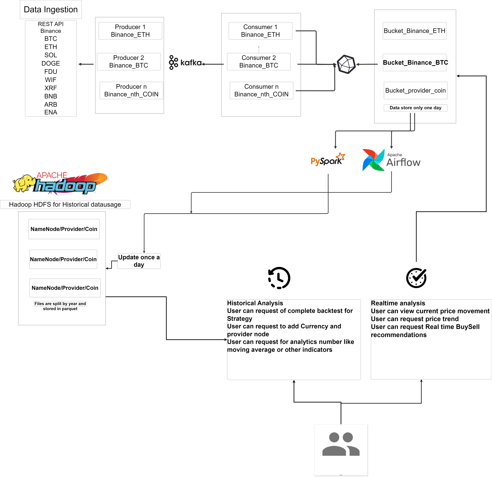

# Crypto-Arbitrage

# Cryptocurrency Data Processing Architecture

## Overview

The architecture diagram `arch.png` illustrates a robust data ingestion and processing system designed for cryptocurrency market data. This system is capable of handling real-time data streaming, historical data storage, and analysis workflows for various cryptocurrencies.

## Architecture Components

- **Data Ingestion**: The system uses the Binance REST API to ingest market data for various cryptocurrencies such as ETH, SOL, DOGE, etc. This data is then produced into Kafka by various producers, each handling a specific cryptocurrency (e.g., Producer 1 for Binance_ETH).

- **Apache Kafka**: Kafka acts as a centralized message broker that handles the streaming data, ensuring decoupling between data producers and consumers.

- **Data Storage**:
  - **Real-time Storage**: Consumed data from Kafka is stored temporarily in specific buckets (e.g., Bucket_Binance_ETH) that hold data for one day.
  - **Historical Storage**: Data is also stored in Hadoop HDFS for long-term historical usage, updated once a day, and files are split by year and stored in parquet format for efficient analytics.

- **Data Processing and Analysis**:
  - **PySpark**: Utilized for scalable data processing and complex analytics.
  - **Apache Airflow**: Orchestrates and schedules the data pipeline workflows.

- **Analysis Types**:
  - **Historical Analysis**: Users can request a complete backtest for a strategy, add currency and provider nodes, and request various analytical indicators like moving averages.
  - **Real-time Analysis**: Users have access to current price movements, price trends, and can receive real-time buy/sell recommendations.

The architecture is designed with scalability and flexibility in mind, allowing for additional cryptocurrencies and analytical features to be added as needed.

## Diagram

Below is the `arch.png` image depicting the architecture:

<!-- Remove later -->
`docker-compose up -d`
`docker stop $(docker ps -aq) && docker rm -f $(docker ps -aq)`
`docker exec -it namenode bash`